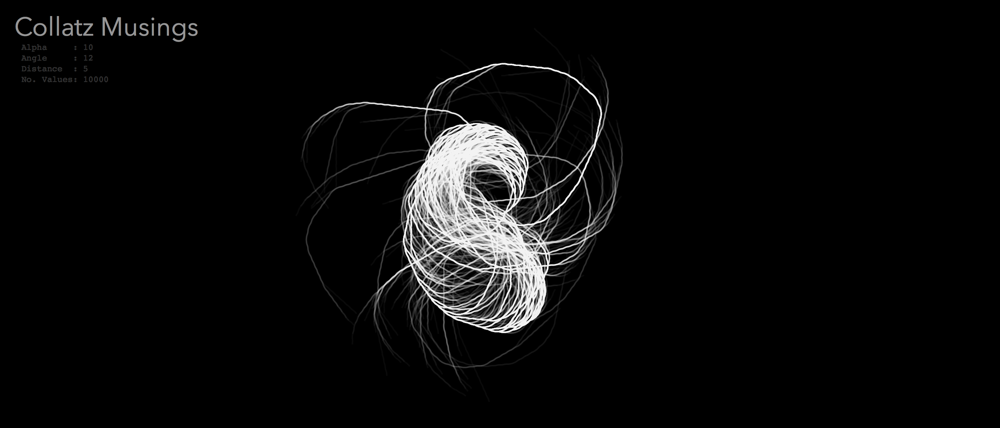
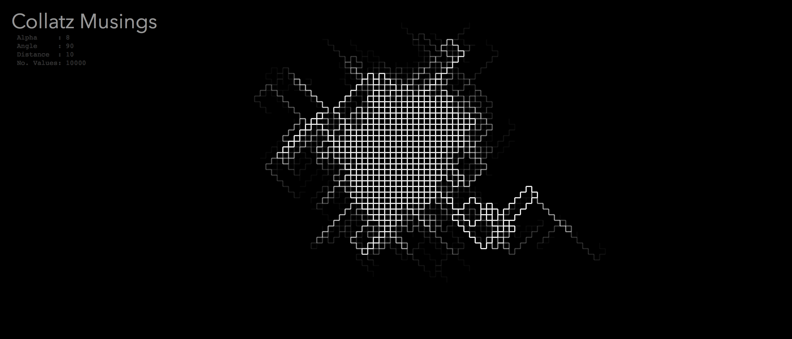
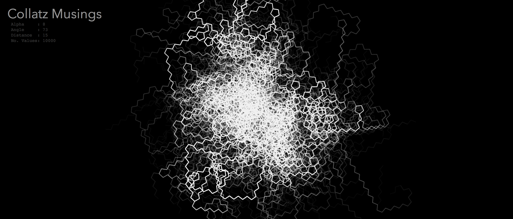
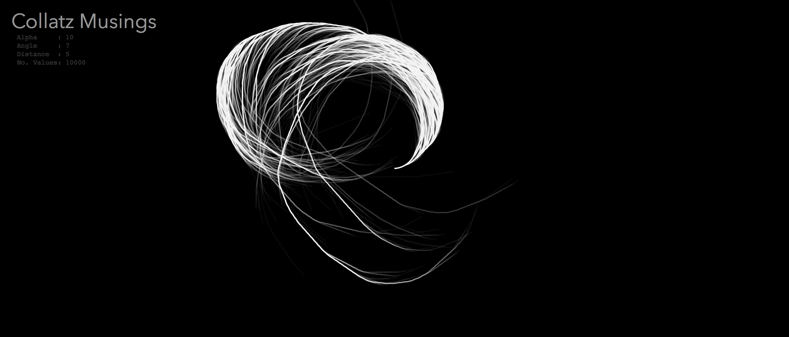
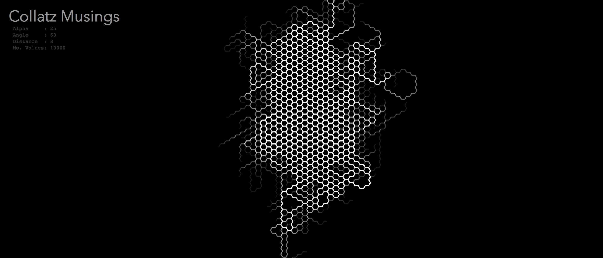
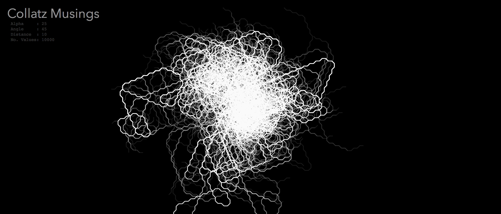

# Collatz Musings

*Visualizations using the Collatz Conjecture rules*

I was inspired to recreate the visualization of the [Collatz Conjecture](https://en.wikipedia.org/wiki/Collatz_conjecture) as shown in this [Numberphile video](https://www.youtube.com/watch?v=LqKpkdRRLZw).  While my results look somewhat different from those shown in the video, some interesting patterns still emerged.

In this interactive visualization, the Collatz sequence is computed for each number in a continuously increasing set.  For each number, a line visualization is drawn based upon its Collatz sequence: starting in the middle of the canvas for the value of 1, turn a specified amount to the left or right depending upon the parity of the next number in the sequence and draw a line of a specific length in that direction. Repeat until all the numbers of the sequence have been processed, where the turn angle continually accumulates across the sequence.

Use the sliders to change the parameters of the visualization:

* **Alpha**: level of transparency used for drawing (lower is more transparent)
* **Angle**: the absolute value of the angle at which to turn prior to drawing the next number in the Collatz sequence
* **Distance**: how far to draw from a Collatz sequence element to the next
* **Speed**: how quickly to generate the Collatz sequences and associated line drawings

The visualization can also be controlled by the interface buttons:

* **Reset**: resets the visualization back to the beginning
* **Pause**: pauses the generation of new Collatz sequences and line drawings
* **Play**: starts/continues the generation processing
* **Jump to Number**: sets the current number to process from the value in the input field
* **Cumulative Render**: using the value in the input field, all numbers upto that value are processed and the resulting visualization is displayed
* **Save Img**: save the visualization to a .png file

The visualization was created entirely using [p5.js](https://p5js.org).

---

## Example Images

