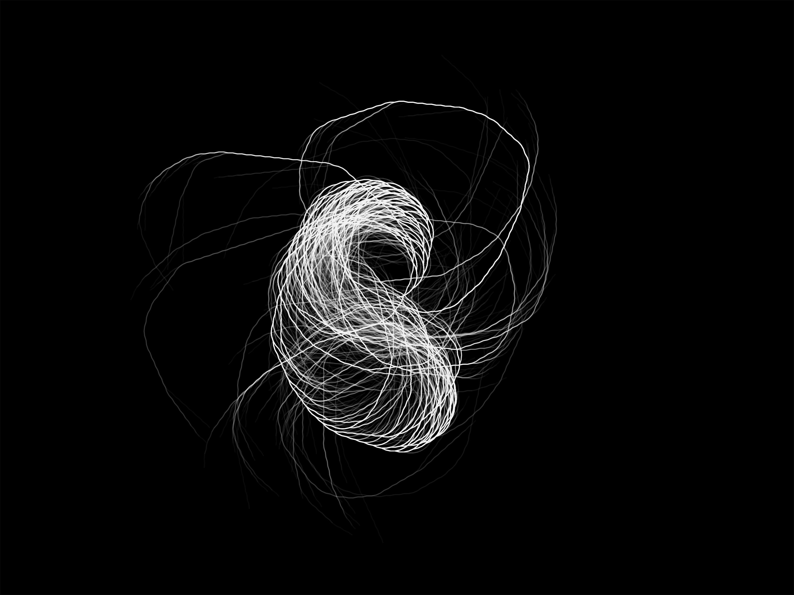

# Collatz Musings

*Visualizations using the Collatz Conjecture rules*

I was inspired to try and recreate the visualization of the [Collatz Conjecture](https://en.wikipedia.org/wiki/Collatz_conjecture) as shown in this [Numberphile video](https://www.youtube.com/watch?v=LqKpkdRRLZw).  I wasn't successful, but I still ended up making some interesting visualizations.

I used [p5.js](https://p5js.org) to create the visualization.  The drawing code is located inside `sketch.js`, and it's really quite simple.

You can get a variety of interesting images by adjusting the `angle` and `maxNum` variables inside the `setup` function.

